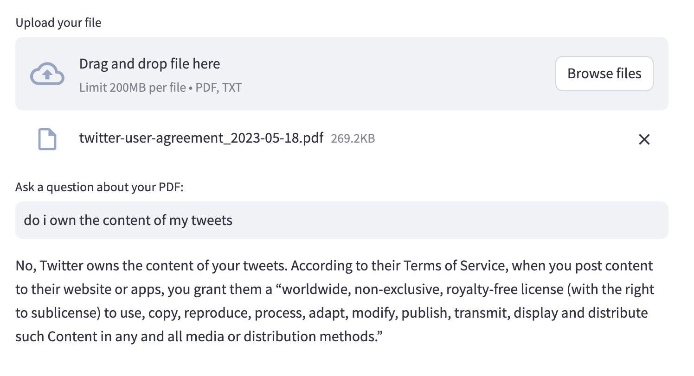

# ChatWithFiles
A chat interface for interrogating uploaded files.

⚠️ NOTE: app will upload portions of the file's contents to the OpenAI API. Do not use with file contianing any personal or propritary information. I suggest using public documents like [Twitter's terms of service](https://cdn.cms-twdigitalassets.com/content/dam/legal-twitter/site-assets/2023-05-18/en/twitter-user-agreement_2023-05-18.pdf)




## Usage:
```shell
# 0. Clone the repo:
# > git clone git@github.com:DevThinkAI/ChatWithFiles.git && cd ChatWithFiles
#
# 1. Create your virtual env.  Many tools for this, choose what you like best
#    Just using python:
#    > python -m venv .venv
#    > source .venv/bin/activate

# 2. Install
pip install -r requirements.txt

# 3. Configure
cp dist.env .env 
# add your openai key

# 3. Run
streamlit run app.py

```

### Want to learn more?
My [weekly newsletter](https://devthinkai.beehiiv.com/) will keep you informed on Generative AI topics important to software developers (without all the hype)
